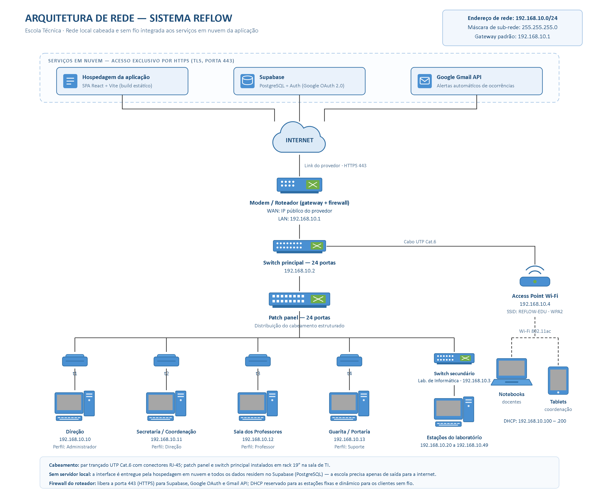

# ARQUITETURA DE REDE — SISTEMA REFLOW

**Sistema:** Reflow — Gestão Inteligente de Espaços Escolares
**Instituição:** Escola Técnica
**Data:** Agosto de 2026

---

## Diagrama da Arquitetura

---

## 1. Visão Geral

O Reflow é uma aplicação web executada no navegador, sem servidor de aplicação instalado na
escola. A infraestrutura local é responsável apenas por **conectar as estações de trabalho à
internet com segurança e desempenho**; a interface é entregue por uma hospedagem em nuvem e
todos os dados residem no Supabase (PostgreSQL).

Essa é a principal diferença em relação a sistemas locais tradicionais: não há servidor web
interno a manter, o que reduz custo de implantação e elimina a necessidade de nobreak,
refrigeração e backup de servidor físico.

---

## 2. Equipamentos da Rede Local

| Nº | Equipamento | Endereço IP | Função na arquitetura |
|---|---|---|---|
| 1 | Modem / Roteador (gateway + firewall) | WAN: IP público · LAN: `192.168.10.1` | Conexão com o provedor, roteamento, NAT e filtragem de portas |
| 2 | Switch principal (24 portas, gerenciável) | `192.168.10.2` | Distribuição da rede cabeada para o patch panel e o access point |
| 3 | Switch secundário (Lab. de Informática) | `192.168.10.3` | Atende as estações do laboratório a partir de um único ponto |
| 4 | Access Point Wi-Fi (802.11ac) | `192.168.10.4` | Cobertura sem fio para notebooks e tablets |
| 5 | Patch panel (24 portas) | — | Organização e terminação do cabeamento estruturado |
| 6 | Tomadas de rede (t1 a t4) | — | Pontos de acesso RJ-45 nas salas administrativas |

---

## 3. Plano de Endereçamento IP

**Endereço de rede:** `192.168.10.0/24`
**Máscara de sub-rede:** `255.255.255.0`
**Gateway padrão:** `192.168.10.1`
**Servidores DNS:** `8.8.8.8` e `1.1.1.1`

| Faixa | Destinação |
|---|---|
| `192.168.10.1` – `192.168.10.9` | Equipamentos de rede (roteador, switches, access point) |
| `192.168.10.10` – `192.168.10.19` | Estações administrativas com IP fixo |
| `192.168.10.20` – `192.168.10.49` | Estações do Laboratório de Informática |
| `192.168.10.100` – `192.168.10.200` | DHCP dinâmico (notebooks e tablets via Wi-Fi) |
| `192.168.10.201` – `192.168.10.254` | Reserva para expansão futura |

### Estações de trabalho

| Ponto | Setor | Endereço IP | Perfil de acesso no Reflow |
|---|---|---|---|
| t1 | Direção | `192.168.10.10` | Administrador |
| t2 | Secretaria / Coordenação | `192.168.10.11` | Direção |
| t3 | Sala dos Professores | `192.168.10.12` | Professor |
| t4 | Guarita / Portaria | `192.168.10.13` | Suporte |
| — | Laboratório de Informática | `192.168.10.20` a `.49` | Professor |
| — | Notebooks e tablets (Wi-Fi) | DHCP | Professor / Direção |

> A escolha da máscara `/24` (254 hosts) atende com folga os equipamentos atuais e permite
> ampliar o parque de máquinas sem reestruturar o endereçamento.

---

## 4. Serviços em Nuvem

| Serviço | Função | Protocolo / Porta |
|---|---|---|
| Hospedagem da aplicação | Entrega do build estático da SPA (React + Vite) | HTTPS / 443 |
| Supabase | Banco de dados PostgreSQL, autenticação e políticas RLS | HTTPS / 443 |
| Google OAuth 2.0 | Login social dos usuários via Supabase Auth | HTTPS / 443 |
| Google Gmail API | Disparo dos alertas de ocorrência por e-mail | HTTPS / 443 |

Todo o tráfego da aplicação sai da escola exclusivamente pela porta **443 (HTTPS/TLS)**, o que
simplifica a política de firewall e mantém os dados criptografados em trânsito.

---

## 5. Cabeamento e Meio Físico

- **Rede cabeada:** par trançado UTP Cat.6, conectores RJ-45, topologia em estrela a partir do
  switch principal; patch panel e switch instalados em rack 19" na sala de TI.
- **Rede sem fio:** padrão 802.11ac na faixa de 5 GHz, SSID `REFLOW-EDU` com segurança WPA2,
  destinada aos dispositivos móveis dos docentes e da coordenação.
- **Enlace externo:** link de banda larga do provedor, terminado no modem/roteador.

---

## 6. Segurança

1. **Firewall no roteador** — libera apenas a porta 443 (HTTPS) para os serviços da aplicação.
2. **Autenticação em nuvem** — o acesso ao Reflow exige login Google gerenciado pelo Supabase
   Auth; não há senhas armazenadas nas estações nem na aplicação.
3. **RLS no banco de dados** — todas as tabelas do Supabase possuem Row Level Security ativa.
4. **Segmentação por perfil** — o controle de permissões (RBAC) é aplicado na aplicação, e não
   na rede, garantindo o mesmo comportamento em qualquer ponto de acesso.
5. **Rede sem fio isolada por senha** — WPA2 com credencial institucional.

---

## 7. Justificativa das Escolhas

| Decisão | Motivo |
|---|---|
| Endereçamento privado `/24` | Compatível com o crescimento do parque de máquinas e dispensa IPs públicos para cada estação |
| Switch secundário no laboratório | Evita puxar 30 cabos até o rack principal, reduzindo custo de cabeamento |
| Access Point dedicado | Permite que professores usem o Reflow em tablets dentro das salas de aula |
| Ausência de servidor local | A aplicação e o banco são serviços em nuvem, reduzindo custo e manutenção |
| Cat.6 e 802.11ac | Suportam com folga o tráfego da aplicação e permitem uso futuro de vídeo e backup |
