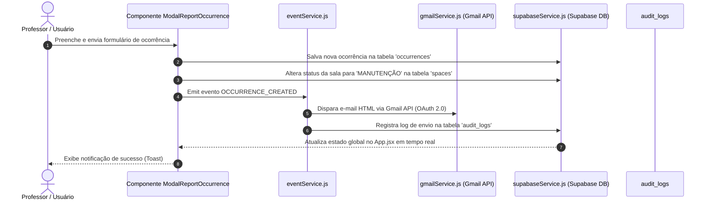

<!-- Documentação de Estrutura de Pastas e Arquivos — Projeto Reflow -->

# ESTRUTURA E ARQUITETURA DO PROJETO REFLOW

**SISTEMA:** Reflow — Gestão Inteligente de Espaços Escolares, Ocorrências e Profissionais  
**INSTITUIÇÃO:** Escola Técnica  
**TECNOLOGIAS:** React, Vite, Supabase (PostgreSQL / Auth), Gmail API OAuth 2.0, SVG Dinâmico, Vanilla CSS  

---

## 1. Visão Geral da Árvore de Diretórios

Abaixo está a representação completa da estrutura de arquivos e diretórios que compõem o repositório do projeto **Reflow**:

```text
Reflow-Trabalho(04-08-26)/
├── .agents/
│   └── AGENTS.md
├── .env
├── index.html
├── package.json
├── package-lock.json
├── vite.config.js
├── dist/                                # Build de produção gerado pelo Vite
├── public/                              # Ativos estáticos públicos
│   ├── Favicon.png
│   ├── logo.webp
│   ├── meditation.webp
│   └── theme-Reflow.css
├── projeto/                             # Documentação e recursos do projeto
│   ├── Estrutura-do-Projeto.md          # [Este Arquivo] Guia detalhado da arquitetura de pastas
│   ├── Mini-mundo.md                    # Documentação do mini mundo, regras de negócio e atores
│   ├── supabase_schema.sql              # Script SQL de criação das tabelas e RLS no Supabase
│   ├── design-system/
│   │   └── theme-Reflow.css             # Tokens do Design System Reflow (Cores, Tipografia, Sombras)
│   └── telas-inspo/                     # Imagens e protótipos de referência de UI/UX
│       ├── Alocando Espaço.jpg
│       ├── Alocações semanais.jpg
│       ├── Cadastro de Colaborador.jpg
│       ├── Colaboradores.jpg
│       ├── Ocorrencias Postada.jpg
│       ├── Painel de espaço livre.jpg
│       ├── Painel de espaço ocupado.jpg
│       ├── Planta Baixa interativa.jpg
│       ├── Reportar ocorrencia.jpg
│       ├── Tela-login.jpg
│       ├── Timeline de Salas.jpg
│       └── Turmas.jpg
└── src/                                 # Código-fonte principal da aplicação React
    ├── App.jsx                          # Componente raiz e gerenciador de estado global/rotas
    ├── main.jsx                         # Ponto de entrada do React DOM
    ├── index.css                        # Estilos globais e componentes utilitários CSS
    ├── components/                      # Componentes React de interface gráfica
    │   ├── AuthCallback.jsx             # Processamento de callback do Supabase OAuth
    │   ├── FABAlert.jsx                 # Botão flutuante para abertura rápida de ocorrências
    │   ├── Header.jsx                   # Barra superior com relógio, busca e perfil do usuário
    │   ├── InteractiveMap.jsx           # Container de navegação por Blocos e Andares
    │   ├── LoginScreen.jsx              # Tela de autenticação (E-mail/Senha e Google OAuth)
    │   ├── OccurrencesCenter.jsx        # Central de Ocorrências e Auditoria de E-mails enviados
    │   ├── SchoolMap.jsx                # Mapa vetorial SVG dinâmico e interativo
    │   ├── SettingsModule.jsx           # Módulo de gestão de reservas, turmas e colaboradores
    │   ├── Sidebar.jsx                  # Menu de navegação lateral por abas
    │   ├── SpaceDrawer.jsx              # Painel lateral desdobrável com detalhes do espaço
    │   └── modals/                      # Modais interativos de formulários
    │       ├── ModalAddClass.jsx        # Cadastro de novas turmas escolares
    │       ├── ModalAddCollaborator.jsx # Cadastro e edição de colaboradores/docentes
    │       ├── ModalProfile.jsx         # Edição de perfil e alteração de papel/cargo
    │       ├── ModalReportOccurrence.jsx# Registro de chamados de suporte técnico/limpeza
    │       └── ModalReserveSpace.jsx    # Agendamento de reservas em salas/laboratórios
    ├── lib/                             # Clientes e inicializações de bibliotecas
    │   └── supabaseClient.js            # Instância oficial do cliente Supabase SDK
    ├── services/                        # Camada de serviços e lógica de integração externa
    │   ├── eventService.js              # Barramento de eventos assíncronos (Pub/Sub Event Emitter)
    │   ├── gmailService.js              # Serviço de envio de e-mails em HTML via Gmail API (OAuth 2.0)
    │   └── supabaseService.js           # Funções CRUD de comunicação com o Supabase
    └── utils/                           # Funções utilitárias e ajudantes de código
        └── spaceStatus.js               # Funções de cálculo de horários e status dinâmico das salas
```

---

## 2. Detalhamento da Pasta Raiz (`/`)

A pasta raiz contém as configurações do ambiente de desenvolvimento, bundler, gerenciador de pacotes e arquivos de ambiente:

| Arquivo / Pasta | Finalidade e Descrição |
| :--- | :--- |
| **`.env`** | Armazena variáveis de ambiente confidenciais da aplicação (como `VITE_SUPABASE_URL`, `VITE_SUPABASE_ANON_KEY`, `VITE_GMAIL_CLIENT_ID`). |
| **`index.html`** | Ponto de entrada HTML único da Single Page Application (SPA). Carrega as fontes do Google Fonts (*Inter*, *JetBrains Mono*) e a tag `<div id="root"></div>`. |
| **`package.json`** | Manifesto do projeto Node.js. Lista as dependências do projeto (`react`, `@supabase/supabase-js`, `lucide-react`, `vite`) e scripts de execução (`npm run dev`, `npm run build`). |
| **`package-lock.json`** | Registra o bloqueio exato de versões das dependências instaladas no `node_modules`. |
| **`vite.config.js`** | Arquivo de configuração do bundler **Vite**. Define a porta do servidor de desenvolvimento e o plugin `@vitejs/plugin-react`. |
| **`dist/`** | Diretório gerado automaticamente durante a compilação de produção (`npm run build`). Contém os arquivos minificados prontos para deploy. |

---

## 3. Detalhamento da Pasta `projeto/`

A pasta **`projeto/`** é dedicada à documentação acadêmica e técnica, ativos de design system e referências visuais da aplicação:

### 📄 Arquivos Principais:
- **`Mini-mundo.md`**: Documento completo do Mini Mundo do projeto. Define a contextualização da Escola Técnica, os atores envolvidos, casos de uso, regras de negócio (R01 a R06), matriz RBAC, esquema do banco de dados e resultados esperados.
- **`Estrutura-do-Projeto.md`**: *(Este arquivo)* Guia analítico da organização de diretórios e arquivos do código-fonte.
- **`supabase_schema.sql`**: Script SQL com todos os comandos `CREATE TABLE` e políticas de segurança RLS (*Row Level Security*) para criação do banco de dados no Supabase.

### 📁 Subdiretórios de `projeto/`:
- **`design-system/`**:
  - `theme-Reflow.css`: Define todas as variáveis CSS nativas (tokens de design) do tema Reflow (como `--primary`, `--background`, `--accent`, `--radius`, `--font-sans`).
- **`telas-inspo/`**:
  - Pasta contendo 12 arquivos de imagem com mockups e capturas de tela que serviram de inspiração visual para o desenvolvimento dos layouts da plataforma.

---

## 4. Detalhamento da Pasta `src/` (Código-Fonte Principal)

A pasta **`src/`** concentra toda a lógica de programação React, componentes de interface, manipulação de estado e integração de APIs.

### 📄 Arquivos Principais de `src/`:

- **`main.jsx`**: Arquivo de inicialização que monta a árvore de componentes do React no elemento `#root` do DOM através de `ReactDOM.createRoot`.
- **`App.jsx`**: Componente centralizador e "cérebro" da aplicação. Responsável por:
  - Gerenciar o estado global da sessão do usuário logado via Supabase Auth.
  - Carregar e armazenar o estado das salas, agendamentos, ocorrências, colaboradores, turmas e logs de auditoria.
  - Alternar a exibição das abas da interface (`map`, `timeline`, `occurrences`, `settings`).
  - Escutar eventos do `eventService` para acionar a notificação por e-mail e persistir logs de auditoria.
- **`index.css`**: Arquivo de folha de estilos global. Contém reset CSS, variáveis de tema, estilos para badges de status, botões, modais, cabeçalhos, efeitos hover e barras de rolagem personalizadas.

---

## 5. Subdiretório `src/components/` (Interface e Componentes)

Contém os componentes modulares de interface visual da aplicação:

### 🧩 Componentes Globais e de Tela:

1. **`Sidebar.jsx`**:
   - Menu lateral fixo da aplicação. Exibe o logotipo **Reflow**, os botões de navegação por aba (*Mapa Interativo*, *Timeline de Salas*, *Central de Ocorrências*, *Configurações*) e a identificação da versão do sistema.

2. **`Header.jsx`**:
   - Barra superior da interface. Contém o campo de busca global, relógio digital atualizado em tempo real e o menu do perfil do usuário logado (exibindo avatar, nome, e-mail, seletor de cargo e botão de logout).

3. **`InteractiveMap.jsx`**:
   - Componente container da visão espacial. Gerencia os botões de seleção de Bloco (*Bloco A* / *Bloco B*) e Andar (*Térreo* / *1º Andar*), renderizando o componente `SchoolMap`.

4. **`SchoolMap.jsx`**:
   - Renderização gráfica do mapa vetorial (SVG) das salas da escola. Aplica cores dinâmicas baseadas no status de cada sala (`LIVRE` = verde, `OCUPADO` = azul/vermelho, `MANUTENÇÃO` = laranja) e lida com o destaque pulsante de busca.

5. **`SpaceDrawer.jsx`**:
   - Painel de detalhes desdobrável (*Drawer*) que surge na lateral da tela quando o usuário clica em uma sala no mapa. Exibe dados do ambiente, ocupante atual, próxima reserva e atalhos para reservar ou abrir ocorrência.

6. **`OccurrencesCenter.jsx`**:
   - Painel da Central de Ocorrências e Suporte Técnico. Permite filtrar chamados por departamento (*TI*, *Limpeza*, *Manutenção*), atualizar o status da solução do problema, autenticar o token OAuth2 do Gmail e consultar a aba de **Auditoria de E-mails Enviados**.

7. **`SettingsModule.jsx`**:
   - Módulo de gestão administrativa com 3 sub-abas:
     - *Minhas Reservas:* Exibe os agendamentos realizados pelo usuário logado.
     - *Turmas:* Lista as turmas cadastradas, permitindo adicionar ou remover turmas (exclusivo Admin/Direção).
     - *Profissionais:* Lista os colaboradores/docentes com busca e filtro por categoria, permitindo adição, edição e exclusão (exclusivo Admin/Direção).

8. **`LoginScreen.jsx`**:
   - Tela de login da aplicação. Oferece autenticação via E-mail e Senha e Login Social com Google OAuth2 via Supabase.

9. **`AuthCallback.jsx`**:
   - Componente de rota responsável por interceptar o redirecionamento OAuth2 do Supabase e validar a sessão do usuário.

10. **`FABAlert.jsx`**:
    - Botão de Ação Flutuante (*Floating Action Button*) posicionado no canto inferior direito da tela para permitindo abertura imediata de chamados de urgência.

---

### 🪟 Subdiretório `src/components/modals/` (Modais)

Contém as caixas de diálogo sobrepostas para entrada e edição de dados:

- **`ModalReserveSpace.jsx`**: Modal para criação de novas reservas. Possui campos de data, faixa de horário, professor, turma e quantidade de alunos, executando checagem de sobreposição de horários e alertas de sobrelotação.
- **`ModalReportOccurrence.jsx`**: Modal para abertura de ocorrências técnicas. Permite selecionar a sala, o tipo da falha (*Projetor/AV*, *Ar-condicionado*, *Limpeza*, etc.), a prioridade (*Baixa*, *Média*, *Alta*) e a descrição do problema.
- **`ModalAddCollaborator.jsx`**: Modal para cadastro e edição de colaboradores/docentes, incluindo iniciais, nome, cargo, categoria, e-mail, telefone, jornada e dias de atuação.
- **`ModalAddClass.jsx`**: Modal simples para cadastrar novas turmas e o número de alunos matriculados.
- **`ModalProfile.jsx`**: Modal para o usuário visualizar seus dados de conta e alterar seu cargo ativo no sistema (*Administrador*, *Professor*, *Suporte*, *Visitante*).

---

## 6. Subdiretório `src/services/` (Camada de Integrações)

Concentra as funções que realizam comunicação com serviços externos, banco de dados e eventos:

1. **`supabaseService.js`**:
   - Concentra todas as operações CRUD com a base de dados PostgreSQL do Supabase:
     - `loadInitialData()`: Carrega em paralelo salas, alocações, ocorrências, colaboradores, turmas e audit logs.
     - `dbAddAllocation()` / `dbDeleteAllocation()`: Adiciona e remove reservas.
     - `dbAddOccurrence()` / `dbResolveOccurrence()`: Cria chamados e atualiza status para resolvido.
     - `dbSaveCollaborator()` / `dbDeleteCollaborator()`: Cria/edita e deleta colaboradores.
     - `dbAddClass()` / `dbDeleteClass()`: Gerencia turmas.
     - `dbUpdateSpaceStatus()`: Atualiza a situação de uma sala (`LIVRE`, `OCUPADO`, `MANUTENÇÃO`).
     - `dbUpdateUserRole()`: Salva o papel do usuário no Supabase Auth.

2. **`gmailService.js`**:
   - Integração com a API REST oficial do Gmail utilizando Google OAuth 2.0.
   - `requestGmailAccessToken()`: Abre o pop-up de autorização de conta do Google.
   - `sendEmailViaGmailAPI()`: Monta e envia e-mails codificados em Base64 com template HTML estilizado contendo detalhes da ocorrência e prioridade.

3. **`eventService.js`**:
   - Implementação leve do padrão de arquitetura orientada a eventos (*Pub/Sub - Event Emitter*).
   - Permite que a criação de uma ocorrência dispara de forma desacoplada o envio de e-mails e a gravação de logs de auditoria sem travar a interface do usuário.

---

## 7. Subdiretório `src/utils/` e `src/lib/`

- **`src/utils/spaceStatus.js`**:
  - `timeToMinutes(timeStr)`: Converte horários formatados (`'08:30'`) para minutos contados desde a meia-noite para facilitar comparações numéricas de sobreposição.
  - `getRealTimeStatus(spaceId, date, time, allocations, occurrences)`: Determina dinamicamente se uma sala está `MANUTENÇÃO`, `OCUPADO` ou `LIVRE` em determinado instante de tempo.
  - `todayDateString()`: Retorna a data atual formatada como `'YYYY-MM-DD'`.

- **`src/lib/supabaseClient.js`**:
  - Cria e exporta a instância do cliente Supabase chamando `createClient(supabaseUrl, supabaseAnonKey)`.

---

## 8. Fluxo Integrado de Funcionamento da Aplicação



---

## 9. Conclusão

Esta estrutura modular do **Reflow** garante alto desacoplamento entre a interface gráfica (`src/components`), a camada de dados (`src/services/supabaseService.js`) e as integrações com serviços externos (`gmailService.js` e Supabase Auth). A organização facilita a manutenção, a inclusão de novas funcionalidades e a auditoria completa do ecossistema.
